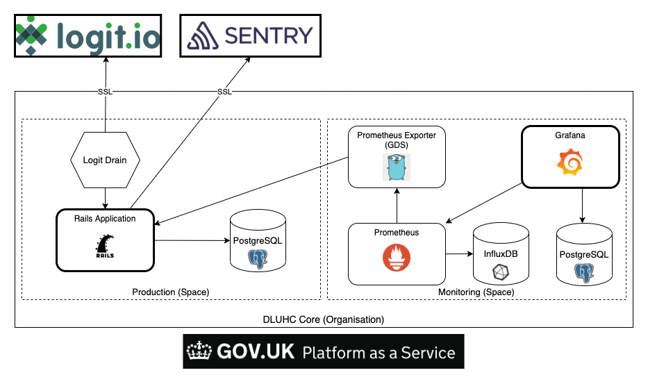

# Monitoring stack for submit social housing lettings and sales data (CORE)

This codebase contains different Github Actions pipelines and a Cloud Foundry manifest used to build our monitoring
stack.

## Stack overview

This codebase relies on an existing monitoring space and automates the creation of three components

- A [Prometheus exporter](https://github.com/alphagov/paas-prometheus-exporter) which queries the `/metrics` endpoint of
  every application and service the configured user (auditor) has access to
- A [Prometheus instance](https://github.com/prometheus/prometheus) persisting collected metrics on an
  [InfluxDB database](https://github.com/influxdata/influxdb)
- A [Grafana instance](https://github.com/grafana/grafana) where dashboards are built reading the prometheus instance
  and persisting on a [PostgreSQL database](https://github.com/postgres/postgres)

## Pipelines overview

### Metrics exporter deployment on GOV.UK PaaS

This pipeline fetches the prometheus exporter project on Github, configure required environment variables and deploy it
to GOV.UK PaaS

#### Environment variables to change in `exporter_deploy.yml`

Note: Add the `env` prefix in the pipeline definition

- **APP_NAME**\
  The application name used for the GOV.UK PaaS deployment (must be unique within space)

#### Secrets to create for Github Actions

Note: Add the `secrets` prefix in the pipeline definition

- **CF_API_ENDPOINT**\
  The GOV.UK API endpoint without the protocol, for example `api.london.cloud.service.gov.uk` for London
- **CF_ORG**\
  The [organisation](https://docs.cloud.service.gov.uk/orgs_spaces_users.html#organisations) name used in GOV.UK PaaS,
  for example `dluhc-core`
- **CF_SPACE**\
  The [space](https://docs.cloud.service.gov.uk/orgs_spaces_users.html#spaces) name used in GOV.UK PaaS, for
  example `monitoring`
- **CF_DEPLOY_USERNAME**\
  The username for the GOV.UK PaaS account used to login and deploy the exporter, must
  have [space developer](https://docs.cloud.service.gov.uk/orgs_spaces_users.html#space-developer)
  permissions for the space configured within the organisation
- **CF_DEPLOY_PASSWORD**\
  The password used by `CF_DEPLOY_USERNAME`
- **CF_AUDIT_USERNAME**\
  The username for the GOV.UK PaaS account used by the exporter to collect application and service metrics. This user
  must have [space auditor](https://docs.cloud.service.gov.uk/orgs_spaces_users.html#space-auditor) permissions for the
  organisation and every space where the exporter needs to collect metrics, for example `staging`, `monitoring`
  and `production`
- **CF_AUDIT_PASSWORD**\
  The password used by `CF_AUDIT_USERNAME`

#### Changes required in `manifest.yml`

- Be sure that the name used for the exporter application definition matches `APP_NAME`
- Create a route unique within GOV.UK PaaS, for example `prometheus-exporter-{your_organisation}`
- Be sure that your route ends with `.apps.internal` so that the exporter is
  a [private application](https://docs.cloud.service.gov.uk/deploying_apps.html#deploying-private-apps)

### Prometheus docker image creation

In order to ease Prometheus updates and deployments, we decided to rely on a Prometheus binary managed by package
manager instead of using the Cloud Foundry binary buildpack.

The official Prometheus Docker image uses BusyBox which has no package manager by default. We settled for the latest
Alpine Linux docker image, installing the Prometheus binary and dependencies required for configuration templates.

The `Dockerfile` present at the root of the repository is used to build our Prometheus docker image which is stored into
the Github Container Registry (ghcr.io).

#### Environment variables to change in `prometheus_build.yml`

Note: Add the `env` prefix in the pipeline definition

- **DOCKER_IMAGE**\
  This is the path used for storing your docker image as a package linked to your repository, for example
  `communitiesuk/{your_repository}/prometheus`

#### Prometheus configuration using InfluxDB as remote read and write

When building your docker image, a script `run_prometheus.sh` (which has the execution bit set), is copied to the docker
image and will be used as entrypoint. The configuration template `prometheus_template.yml` is also copied. During the
container startup, this script will fetch the InfluxDB configuration from GOV.UK PaaS and generate a `prometheus.yml`
configuration filling the template file.

### Prometheus deployment on GOV.UK PaaS

Once your Prometheus docker image is built and stored on Github Container Registry, you may want to deploy Prometheus on
GOV.UK PaaS.

### Metrics exporter deployment on GOV.UK PaaS